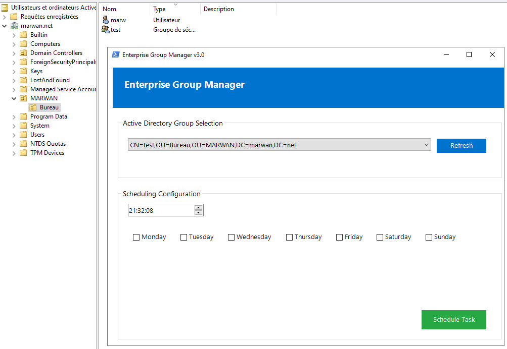

# Accessify – Automate AD Group Membership by Day

**Accessify** is a lightweight PowerShell GUI tool to automate Active Directory group membership based on the day of the week.  
No scripting required — just configure the schedule and user files, and you're done.

[Check out the tool on Gumroad (50% Launch Discount)](https://baccari8.gumroad.com/l/fmyhq)

## Use Cases

- Auto-manage VPN or shared folder access
- Temporary access control (Monday-only access, etc.)
- Reduce manual admin tasks in hybrid AD environments

## How it Works

- A simple GUI lets you select groups and days
- Daily `.txt` files (like `Monday.txt`, `Tuesday.txt`) list users
- At the scheduled time, Accessify updates the groups automatically

## What's included (Gumroad version)

- Complete PowerShell script + GUI
- Full PDF doc (non-technical friendly)
- Error handling, customization options
- License for internal use

## Access

To keep the tool clean and high-quality, the full version is available on Gumroad.

[Get Accessify on Gumroad](https://baccari8.gumroad.com/l/fmyhq)  
Launch promo: 50% off
